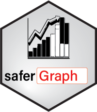

# saferGraph <a href="">[](https://safer-r.github.io/saferGraph)</a>

<br />

<!-- badges: start -->

[](https://app.codecov.io/github/safer-r/saferGraph?branch=master)
[](https://cran.r-project.org/package=saferGraph)
[](https://www.rdocumentation.org/trends)
[](https://opensource.org/licenses/MITgpl-3-0)
[](https://github.com/safer-r/saferGraph/actions/workflows/rworkflows.yml)
<!-- badges: end -->

<br />

## Table of content

   - [Description](#description)
   - [Content](#content)
   - [Versions](#versions)
   - [Installation](#installation)
   - [Licence](#licence)
   - [Citations](#citations)
   - [Credits](#credits)
   - [Acknowledgements](#acknowledgements)

<br />

## Description

Set of R functions for the development of R functions, written according to the [safer project](https://github.com/safer-r) specifications.

<br />

## Content

| Function | Description |
| --- | --- |
| **close()** | Close only specific graphic windows (devices). |
| **empty_graph()** | Display an empty plot with a text in the middle of the window (for instance to specify that no plot can be drawn). |
| **inter_ticks()** | Verify that object names in the environment defined by the pos argument are identical or not to object names in the above environments (following R Scope). This can be used to verify that names used for objects inside a function or in the working environment do not override names of objects already present in the above R environments, following the R scope. |
| **open()** | Open a pdf or screen (GUI) graphic window and return initial graphic parameters. |
| **post_plot()** | Redesign axis. If x.side = 0, y.side = 0, the function just adds text at topright of the graph and reset par() for next graphics and provides outputs. Provide also positions for legend or additional text on the graph. Use prior_plot() before this function for initial inactivation of the axis drawings. |
| **prior_plot()** | Very convenient to erase the axes for post plot axis redrawing using post_plot(). Reinitialize and set the graphic parameters before plotting. CANNOT be used if no graphic device already opened. |
| **scale()** | Attempt to select nice scale numbers when setting n ticks on a lim axis range. |
| **width()** | Rescale the width of a window to open depending on the number of categories of qualitative variable to plot on the x-axis. Can be used for height, considering that it is as if it was a width. |

<br />

Read `vignette("saferGraph")` for more details.

<br />

## Versions

The different *saferGraph* releases are tagged [here](https://github.com/safer-r/saferGraph/tags).

<br />

## Installation

*saferGraph* can be currently be installed from GitHub:

```r
install.packages("remotes")
remotes::install_github("https://github.com/safer-r/saferGraph")
```

Older versions can be installed like this:

```r
v <- "v1.0" # desired tag version
remotes::install_github(paste0("https://github.com/safer-r/saferGraph/tree/", v))
```

<br />

## Licence

This package can be redistributed and/or modified under the terms of the GNU General Public License as published by the Free Software Foundation, either version 3 of the License, or (at your option) any later version.
Distributed in the hope that it will be useful, but without any warranty; without even the implied warranty of merchandability or fitness for a particular purpose.
See the GNU General Public License for more details at https://www.gnu.org/licenses.

<br />

## Citation

If you are using functions of *saferGraph*, please cite: 

> Han Y, Serizay J, Millot GA (2023). _The R saferGraph package_.
> <https://github.com/safer-r/saferGraph/>.

<br />

## Credits

[Yushi Han](https://github.com/yushiHn/), Bioinformatics and Biostatistics Hub, Institut Pasteur, Paris, France

[Jacques Serizai](https://github.com/js2264), Spatial Regulation of Genomes team, Institut Pasteur, Paris, France

[Gael A. Millot](https://github.com/gael-millot), Bioinformatics and Biostatistics Hub, Institut Pasteur, Paris, France

<br />

## Acknowledgements

The developers & maintainers of the mentioned softwares and packages, including:

- [R](https://www.r-project.org/)
- [Git](https://git-scm.com/)
- [Github](https://github.com/)

